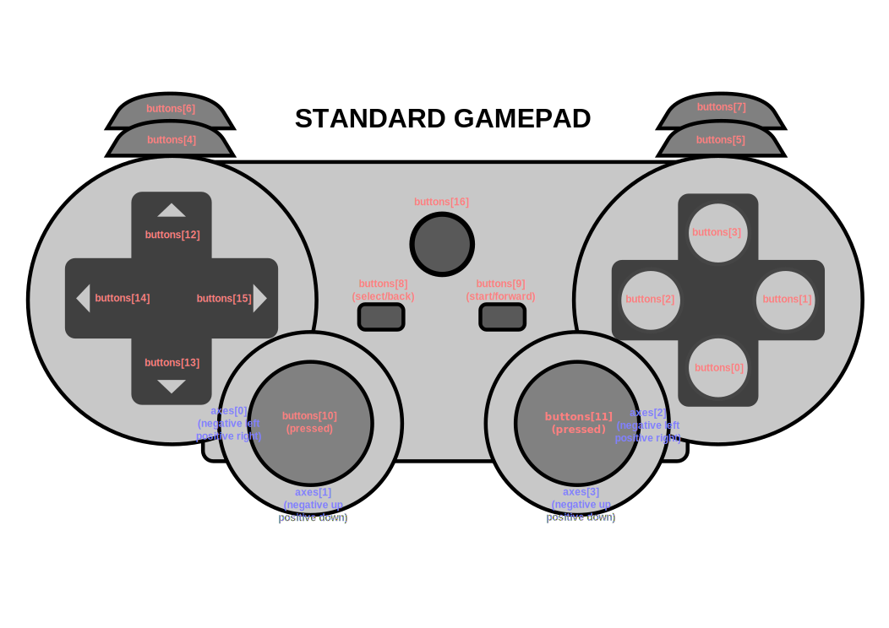

# Gamepad Prototype

This repository contains the Gamepad Navigation Prototype, a demo for experiencing the browser and webpage navigation using a standard game controller such as Xbox gamepad. This project stands as a ***low-level prototype*** for the main project: **Using a Game Controller as a Navigation Aid**. I have listed a few details about the main project as well, below in the **Technologies Used** section.

## Technologies Used

The prototype uses the following technologies and languages:

- [HTML5 Gamepad API](https://developer.mozilla.org/en-US/docs/Web/API/Gamepad_API)
- [JQuery](https://jquery.com)
- JavaScript
- CSS3

In this prototype, the ***HTML5 Gamepad API*** is used to establish connectivity between the browser and the gamepad. Further, it is used to read the values of the nputs passed by the various keypresses or joystick events. On top of this, we have used the ***JavaScript*** to implement the handlers for the key and joystick events which are needed for navigation and other background processes. Some ***JQuery*** was also used to make the event handlers more efficient.

***Note:*** The original Gamepad project will be built using [Infusion](https://fluidproject.org/infusion.html), a high performance and clean, client-side JavaScript framework that uses JQuery in its core. The solution will require using a [Chrome Extension](https://developer.chrome.com/extensions), [ElectronJs](https://www.electronjs.org/) or an API/Tool that is compatible with majority of the browsers.

## Controls

  

Below is the list of buttons with their corresponding functionalities specified along:  
(_Please refer to the above diagram for the below mentioned buttons and axes_)

| Keys | Functionality | Analogous Keyboard Keys |
| :---: | :---: | :---: |
| `Button 0` | Select or Click on the focussed element | `Enter` |
| `Button 1` | Back or Cancel | `Esc` |
| `Button 3` | Move to next focusable element | `Tab` |
| `Button 2` | Move to previous focusable element | `Shift` + `Tab` |
| `Button 9` | Reload the webpage | `Ctrl` + `R` |
| `Button 12` or `Button 14` or   `Axes 3` _Negative_ (`Right Joystick` _Up_) | Move to previous option in the dropdown or select field | `↑` |
| `Button 13` or `Button 15` or   `Axes 3` _Positive_ (`Right Joystick` _Down_) | Move to next option in the dropdown or select field | `↓` |
| `Left Joystick` _up_ and _down_   or `Axes 0` | Scroll vertically across the webpage | `↑` and `↓` |
| `Left Joystick` _left_ and _right_   or `Axes 1` | Scroll horizontally across the webpage | `←` and `→` |
| `Button 6` | Move to previous page in history | `Alt` + `←` |
| `Button 7` | Move to next page in history | `Alt` + `→` |
